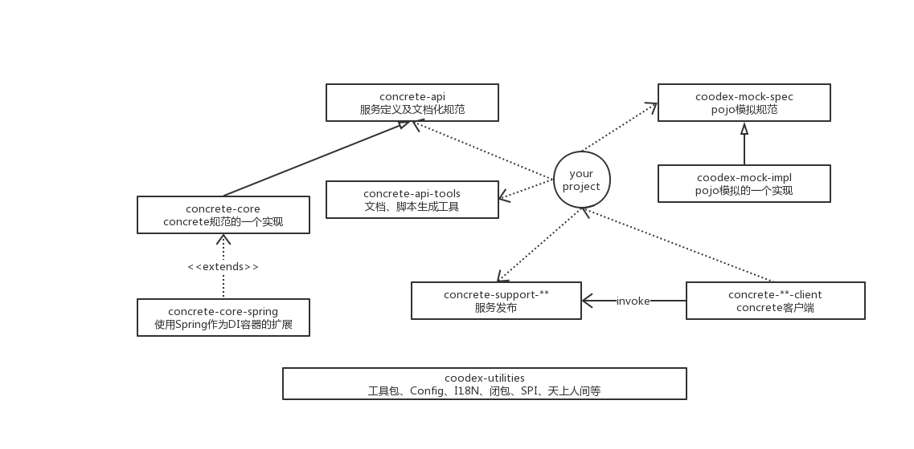

# Concrete

Concrete 是一种基于java的服务定义规范。尝试通过服务定义规范和工具链的支持，最大程度上降低开发者对技术的依赖，让开发者把更多的精力投入到需求分析、接口设计上.

我个人比较推崇技术0价值论，技术就是一堆0，应用场景才是最前面的1，没有应用场景的技术最终还是0，这也是我理解的为什么这么多技术组件选择开源的原因，所以，对于业务应用的开发者来讲，做好应用层才是最体现价值的点。
这也是Concrete的价值观，通过对应用中较通用技术模式在不失扩展性的前提下进行封装来剥离应用开发者的关注点，将精力放到更有价值的事上。

concrete当前版本为0.4.0-SNAPSHOT，已发布到[sonatype](https://oss.sonatype.org/)的快照库中。本文档编写完成时，会发布0.4.0到中央库。

[项目地址 https://github.com/coodex2016/concrete.coodex.org](https://github.com/coodex2016/concrete.coodex.org) 欢迎fork，欢迎提issue

感谢[JetBrains](https://www.jetbrains.com/?from=concrete)提供IDE工具开源授权。

> #### Note::
>
> 本正在文档重新编写过程中...

## Concrete构成

- concrete-api

  concrete-api主要用于定义concrete服务，包括了命名、RBAC、限流、异常信息、日志、签名验签、文档化、Token、Account、Warning、发布订阅、服务发布等
  
- concrete-core

  对concrete规范的一个默认实现，包括APM、服务结构化、拦截器、签名眼前、Token管理、发布订阅实现等。定义了BeanProvider，由所选择的DI容器自行扩展。
  
- concrete-core-spring

  基于[Spring framework](https://spring.io/projects/spring-framework)的一个BeanProvider实现，为concrete提供DI支持。
  并基于[Spring framework](https://spring.io/projects/spring-framework)封装了concrete-client、Topic等concrete组件的DI规范实现。
  定义了使用concrete-core-spring的一些约定
  
- concrete-api-tools

  根据项目所使用的concrete定义规范，生成服务文档、[jquery](https://github.com/jquery/jquery)、[Angular](https://angular.io/)、[axios](https://github.com/axios/axios)调用脚本、RXJava的代码

- concrete-support-**

  服务发布的支持系列模块
  
  - concrete-support-jsr311/ concrete-support-jsr339
  
    基于JaxRS1.0/ 2.0规范的服务发布支持。
    特别一提：concrete-support-jaxrs-swagger，一个基于OpenAPI规范、swagger-ui即插即用的文档、调试工具插件
    
  - concrete-support-amqp
  
    使用amqp broker发布服务，解决服务端无法固定公网地址端口的痛点
    
  - concrete-support-websocket
  
    基于Jsr356 Websocket的服务发布支持
    
  - concrete-support-dubbo
  
    使用com.alibaba:dubbo:2.6.6进行服务发布。
    
    此模块开发较早，后来dubbo捐献给apache，org.apache.dubbo系列API上有一些broken change，并未能直接支持，后续会开发concrete-support-apache-dubbo进行支持
    
- concrete-**-client(-rx)

  基于concrete规范的服务Java调用端，-rx的包支持rxjava2

  - concrete-jaxrs-client(-rx)
  
    调用jaxrs发布的concrete服务的java客户端实现
  
  - concrete-amqp-client
  
    调用amqp broker发布的concrete服务的java客户端实现，支持rxjava2
    
  - concrete-websocket-client-rx
  
    调用websocket发布的concrete服务的java客户端实现，支持同步调用
    
  - concrete-dubbo-client(-rx)
  
    调用com.alibaba:dubbo发布的concrete服务的Java客户端实现
    
- coodex-mock-spec/ coodex-mock-impl

  一套模拟POJO的定义规范/ 实现。[Usage](coodex-mock/README.md)
    
- coodex-utilities

  一些coodex的工具包，以及一些coodex认为比较好用的可扩展机制封装：coodex SPI、Config、Closure、I18N、天上人间等

>  #### Note::
>
> 实际上，[coodex.org](https://coodex.org)将几个项目都合并到concrete项目中一起发布，后续会逐一拆分出来