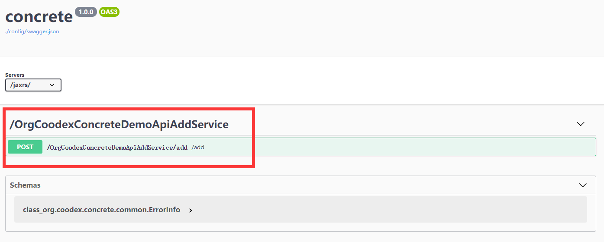

# 定义一个concrete服务

先按照约定创建`demo-api`模块，引入`concrete-api`规范。

```xml
    <dependencies>
        <dependency>
            <groupId>org.coodex</groupId>
            <artifactId>concrete-api</artifactId>
        </dependency>
    </dependencies>
```

在这个模块下新建`interface`

```java
package org.coodex.concrete.demo.api;

import org.coodex.concrete.api.ConcreteService;

@ConcreteService
public interface AddService {

    int add(int x1, int x2);
}
```

ok, 这就是一个最基本的concrete service了。有什么用呢？不急，一点点看，先把实现和服务跑起来。下面先简单一过，让结构完整起来，我们再一点点了解concrete

## 建demo-impl模块

```xml
<project xmlns="http://maven.apache.org/POM/4.0.0"
         xmlns:xsi="http://www.w3.org/2001/XMLSchema-instance"
         xsi:schemaLocation="http://maven.apache.org/POM/4.0.0 http://maven.apache.org/xsd/maven-4.0.0.xsd">
    <parent>
        <artifactId>demo-pom</artifactId>
        <groupId>org.coodex.concrete.demo</groupId>
        <version>1.0-SNAPSHOT</version>
    </parent>
    <modelVersion>4.0.0</modelVersion>

    <artifactId>demo-impl</artifactId>

    <dependencies>

        <!-- 使用javax inject规范,jsr-330 -->
        <dependency>
            <groupId>javax.inject</groupId>
            <artifactId>javax.inject</artifactId>
            <scope>provided</scope>
        </dependency>

        <!-- 依赖api，对其进行实现 -->
        <dependency>
            <groupId>${project.parent.groupId}</groupId>
            <artifactId>demo-api</artifactId>
            <version>${project.parent.version}</version>
        </dependency>

    </dependencies>


</project>
```

实现，比较简单

```java
package org.coodex.concrete.demo.impl;

import org.coodex.concrete.demo.api.AddService;

import javax.inject.Named;

@Named//inject规范
public class AddServiceImpl implements AddService {

    @Override
    public int add(int x1, int x2) {
        return x1 + x2;
    }
}
```

这里注意一下，我们并不是使用spring相关的注解，concrete主张依赖规范而不依赖具体。

## 建demo-boot模块

```xml
<project xmlns="http://maven.apache.org/POM/4.0.0"
         xmlns:xsi="http://www.w3.org/2001/XMLSchema-instance"
         xsi:schemaLocation="http://maven.apache.org/POM/4.0.0 http://maven.apache.org/xsd/maven-4.0.0.xsd">
    <parent>
        <artifactId>demo-pom</artifactId>
        <groupId>org.coodex.concrete.demo</groupId>
        <version>1.0-SNAPSHOT</version>
    </parent>
    <modelVersion>4.0.0</modelVersion>

    <artifactId>demo-boot</artifactId>

    <dependencies>

        <dependency>
            <groupId>${project.parent.groupId}</groupId>
            <artifactId>demo-impl</artifactId>
            <version>${project.parent.version}</version>
        </dependency>

        <!-- 使用jsr339/jaxrs 2.0 发布concrete服务 -->
        <dependency>
            <groupId>org.coodex</groupId>
            <artifactId>concrete-spring-boot-jaxrs</artifactId>
        </dependency>

        <!-- swagger支持，方便查看和实验而已，非必须 -->
        <dependency>
            <groupId>org.coodex</groupId>
            <artifactId>concrete-support-jaxrs-swagger</artifactId>
        </dependency>


        <!-- 使用javax.inject规范，而不是spring规范 -->
        <dependency>
            <groupId>javax.inject</groupId>
            <artifactId>javax.inject</artifactId>
        </dependency>

    </dependencies>


</project>
```

demoBoot

```java
package org.coodex.concrete.demo.boot;

import org.coodex.concrete.spring.boot.EnableConcreteJAXRS;
import org.springframework.boot.SpringApplication;
import org.springframework.boot.autoconfigure.SpringBootApplication;

@SpringBootApplication(
        scanBasePackages = "org.coodex.concrete.demo.**.impl"
)
// 启用concrete jaxrs
@EnableConcreteJAXRS(
        servicePackages = "org.coodex.concrete.demo.**.api"
)
public class DemoBootStarter {

    public static void main(String[] args) {
        SpringApplication.run(DemoBootStarter.class, args);
    }

}
```

> #### Note::
>
> EnableConcreteJAXRS是一个基于Spring-boot的注解，可以用来快捷开启concrete的jaxrs功能，通常用来指定需要发布的服务包，servletMapping，一共有四个属性
>
> - servicePackages: String[], 扫描concreteServices的包，默认使用[`Configuration`](../coodex-utilities/config.md)命名空间`concrete`/`jaxrs`/`当前appSet`下的`api.packages`，如果为空，则使用`Configuration`命名空间`concrete`/`当前appSet`下的`api.packages`
> - classes: Class&lt;?>[], 额外需要注册的类，默认使用`Configuration`命名空间`concrete`/`jaxrs`/`当前appSet`下的`jaxrs.classes`
> - application: Class&lt;? extends ConcreteJSR339Application>，用于发布jaxrs服务的Application类，默认`org.coodex.concrete.spring.boot.Jsr339Application`
> - servletMappingUrls: String[], servlet的Mapping，默认`Configuration`命名空间`concrete`/`jaxrs`/`当前appSet`下的`jaxrs.servletMapping`，如果为空则为`/jaxrs/*`

run it.这样服务就被发布起来了，我们看到demo-boot模块里依赖了`concrete-support-jaxrs-swagger`，它负责按照OpenAPI规范结合swagger-ui进行接口说明以及接口调试，建议开发环境使用，生产环境中移除此依赖。

> #### Note::
>
> 在实际的项目中，建议最终发布的环境单独一个模块，开发的时候额外建一个模块，依赖发布的包和`concrete-support-jaxrs-swagger`, 随便写个`class`来run SpringBootApplication

好了，http://localhost:8080/jaxrs/swagger



上面红框中就是我们发布的服务，可以操作一下看看。

`concrete`遵循约定优于配置的理念，不需要做任何配置也可以使用。这个服务名不是很友好，下面看看如何更友好。
