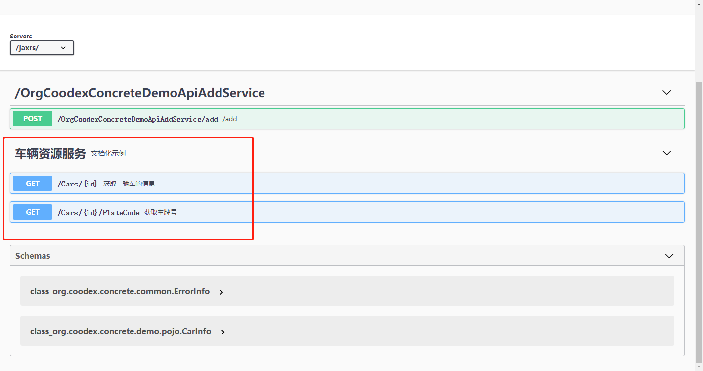

# 优化定义

前面的案例中，我们看到使用`concrete`开发的大概构成,`api`/`impl`/`boot`，为了加快示例，我们把`impl`先省掉，使用[`coodex-mock`](../coodex-mock/README.md)来提供服务。

`demo-api`，增加`coodex-mock-spec`规范的依赖，这样就可以在api定义的时候使用mock规范

```xml
        <dependency>
            <groupId>org.coodex</groupId>
            <artifactId>coodex-mock-spec</artifactId>
        </dependency>
```

`demo-boot`中，`test`作用域增加一个`concrete-core-mock`的依赖

```xml
        <dependency>
            <groupId>org.coodex</groupId>
            <artifactId>concrete-core-mock</artifactId>
            <scope>test</scope>
        </dependency>
```

> #### Note::
>
> `concrete-core-mock`提供了基于`coodex-mock`的一个拦截器实现，开箱即用。

然后在`demo-boot`的`test`代码空间里随便写个class来run之前的application

```java
package org.coodex.concrete.demo.boot;

import org.springframework.boot.SpringApplication;

public class MockBoot {

    public static void main(String[] args) {
        SpringApplication.run(DemoBootStarter.class, args);
    }
}
```

跑起来，还是上一步的操作方式，我们使用`swagger`提交一个x1=1,x2=1的请求，看看结果，这时候不是2了，是一个随机数了，也就是说，`concrete-core-mock`代理掉了实现，或者说，不需要实现也可以进行前后端接口联调

> #### Note::
>
> `concrete-core-mock`主要目的是用来支撑前后端并行开发，前端、后端都遵循api的约定即可。

既然我们已经有了`AddService`的实现，我们把它从mock拦截器中移除掉先。

`mock.excepted`

```txt
org.coodex.concrete.demo.api.AddService
```

再跑起来，swagger，结果正确了。

现在正式开始优化定义，我们新建一个服务

```java
package org.coodex.concrete.demo.api;

import org.coodex.concrete.api.ConcreteService;
import org.coodex.concrete.api.Description;
import org.coodex.concrete.demo.pojo.CarInfo;
import org.coodex.mock.Mock;
import org.coodex.mock.ext.VehicleNum;

@ConcreteService("cars")
@Description(name = "车辆资源服务", description = "文档化示例")
public interface CarService {

    @ConcreteService("/{id}/PlateCode")
    @VehicleNum
    @Description(name = "获取车牌号", description = "根据一辆车的id获取它车牌号")
    String getCarNumberById(
            @Description(name = "车辆id")
            @Mock.String
            String id);

    @ConcreteService("/{id}")
    @Description(name = "获取一辆车的信息", description = "数据包括车牌号车牌颜色等")
    CarInfo getCarById(
            @Description(name = "车辆id")
            @Mock.String
            String id);
}
```

其中`CarInfo`的定义是

```java
package org.coodex.concrete.demo.pojo;

import org.coodex.concrete.api.Description;
import org.coodex.mock.Mock;
import org.coodex.mock.ext.FullName;
import org.coodex.mock.ext.IdCard;
import org.coodex.mock.ext.VehicleNum;

public class CarInfo {
    @VehicleNum
    @Description(name = "车牌号码")
    private String plateCode;
    @Mock.Number("[0,4],9")
    @Description(name = "车牌颜色", description = "按照国标定义")
    private Integer plateColor;

    @Description(name = "车主姓名")
    @FullName
    private String ownerName;
    @Description(name = "车主身份证号")
    @IdCard
    private String idCard;

    @Description(name = "车辆品牌")
    @Mock.String(range = {"兰博基尼", "玛莎拉蒂", "奔驰", "宾利", "奥迪", "宝马"})
    private String brand;

    public String getPlateCode() {
        return plateCode;
    }

    public void setPlateCode(String plateCode) {
        this.plateCode = plateCode;
    }

    public Integer getPlateColor() {
        return plateColor;
    }

    public void setPlateColor(Integer plateColor) {
        this.plateColor = plateColor;
    }

    public String getOwnerName() {
        return ownerName;
    }

    public void setOwnerName(String ownerName) {
        this.ownerName = ownerName;
    }

    public String getIdCard() {
        return idCard;
    }

    public void setIdCard(String idCard) {
        this.idCard = idCard;
    }

    public String getBrand() {
        return brand;
    }

    public void setBrand(String brand) {
        this.brand = brand;
    }
}

```

run



可以看到，红框中的部分和我们之前的风格不一样了，url贴近restful，服务说明也更清晰。

这个案例中，我们把api设计的三个部分进行了统一演示：api命名，文档化，模拟数据。

## api命名

`@ConcreteService`注解可以重命名服务或者模块，在jaxrs中，可以让你的api定义更贴合restful风格。详细[参见](../concrete-api/ConcreteService.md)

## 文档化

`@Description`可以对模块、服务、属性、参数进行文档化注解，把api设计和api文档合到一起。详细[参见](../concrete-api/Description.md)

## 模拟数据

定义模拟数据，让没有后端实现也可以进行接口联调。详细[参见](../coodex-mock/README.md)
