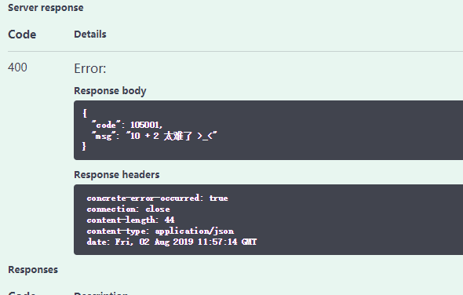

# 异常信息

`concrete`的理念是，服务根据传入数据给出结果，我们称之为“正常”，其他情况都是异常，每个异常给定一个异常码和异常信息，由调用者决定如何处理。

我们通过一个示例来进行说明。

我们设计一个新的AddService，它负责处理个位数加法，超出范围时，给调用者返回一个太难了的异常信息。

在`demo-api`模块中，定义一个`DemoErrorCodes`类，用来放异常码常量

```java
package org.coodex.concrete.demo.api;

import org.coodex.concrete.common.AbstractErrorCodes;

public class DemoErrorCodes extends AbstractErrorCodes {

    protected static final int DEMO_BASED = CUSTOM_LOWER_BOUND + 5000;

    public static final int TOO_HARD = DEMO_BASED + 1;
}
```

新建十以内加法服务

```java
package org.coodex.concrete.demo.api;

import org.coodex.concrete.api.ConcreteService;
import org.coodex.concrete.api.Description;

@ConcreteService
@Description(name = "十以内加法")
public interface AddWithIn10Service {

    Integer add(Integer x1, Integer x2);
}

```

在`demo-api`的资源目录中`i18n`目录下定义异常信息模板

- `message.yml`

```yml
message:
  105001: "{0} + {1} is too hard >_<"
```

- `message_zh_CN.yml`

```yml
message:
  105001: "{0} + {1} 太难了 >_<"
```

在`demo-impl`模块增加实现。先增加`concrete-core`的依赖，在`concrete-core`中，对ErrorCode规范有一套默认实现，开箱即用。

```xml
        <!-- 使用concrete的工具链 -->
        <dependency>
            <groupId>org.coodex</groupId>
            <artifactId>concrete-core</artifactId>
        </dependency>
```

实现类

```java
package org.coodex.concrete.demo.impl;

import org.coodex.concrete.common.IF;
import org.coodex.concrete.demo.api.AddWithIn10Service;

import javax.inject.Named;

import static org.coodex.concrete.demo.api.DemoErrorCodes.TOO_HARD;

@Named
public class AddWithIn10ServiceImpl implements AddWithIn10Service {

    @Override
    public Integer add(Integer x1, Integer x2) {
        // IF是concrete工具链提供的工具之一
        // 下面的接口就是说，如果满足条件（参数1），则抛出TOO_HARD异常(参数2)，并传入信息渲染的参数（参数3，可变参数）
        IF.is(x1 < 0 || x1 > 9 || x2 < 0 || x2 > 9,
                TOO_HARD,
                x1, x2);
        return x1 + x2;
    }
}
```

> #### Note::
>
> IF是concrete工具链提供的工具之一，[点我查看](../concrete-core/IF.md)

还有个工作，上一步中，我们开启了mock，因此需要把这个服务例外出来

`demo-boot`的test作用域中的`mock.excepted`中增加

```txt
org.coodex.concrete.demo.api.AddWithIn10Service
```

跑起来，然后用swagger试试

x1=1,x2=2，结果是正确的，3

x1=10,x2=2，结果如下：



切换一下浏览器的语言顺序，把英语提前，你会看到信息变成了

```json
{
  "code": 105001,
  "msg": "10 + 2 is too hard >_<"
}
```

`concrete`的errorCode机制使用了`coodex-utilities`的[`I18N`](../coodex-utilities/i18n.md)服务，很好的支持了国际化。

> #### Note::
>
> 本案例中ErrorCode和Service在同一个包下，如果你的工程分开维护，记得把ErrorCodes的包或者类也注册到Application中

## 数据旋绕

concrete提供两种数据渲染方式，默认为基于`java.text.MessageFormat`，我们案例种使用的就是这种，另一种是基于Freemarker模板的。现在虽然支持扩展，但是理解和使用上不一定合适，多模板选择也意味着需要掌握的渲染模板知识越多，`coodex`也在犹豫下一步怎么弄，暂时先不推荐选择其他渲染方式。

## 实践方案

### 按模块划分

```java
public class ProjectErrorCodes extends AbstractErrorCodes{
    //非具体错误号不要用public
    protected static final int MODULE1 = CUSTOM_LOWER_BOUND;

    protected static final int MODULE2 = MODULE1 + 5000;

    // ....
}


public class Module1ErrorCodes extends ProjectErrorCodes{

    public static final int ERROR1 = MODULE1 + 1;

    //....
}

// ....

```

### 团队协作时按人划分

```java
public class ProjectErrorCodes extends AbstractErrorCodes{

    //非具体错误号不要用public
    protected static final int 西门吹雪 = CUSTOM_LOWER_BOUND;

    protected static final int 陆小凤 = 西门吹雪 + 5000;

    // ....
}


public class 西门吹雪ErrorCodes extends ProjectErrorCodes{

    public static final int 挂点 = 西门吹雪 + 1;

    //....
}

// ....

```

好吧，实际上怎么划分无所谓，只要**不重复**，用起来方便，其他看心情就好。我们还是推荐团队约定。

### 异常资源协作

`concrete-api`的`AbstractErrorCodes`中定义了一个注解`Namespace`，用来指定当前这个ErrorCodes的命名空间。我们在这个案例基础上简单改下

```java
package org.coodex.concrete.demo.api;

import org.coodex.concrete.common.AbstractErrorCodes;

@AbstractErrorCodes.Namespace("demoErrorCodes") // 指定命名空间
public class DemoErrorCodes extends AbstractErrorCodes {

    protected static final int DEMO_BASED = CUSTOM_LOWER_BOUND + 5000;

    public static final int TOO_HARD = DEMO_BASED + 1;
}
```

上述的注解指定了DemoErrorCodes模块使用`demoErrorCodes`命名空间

我们增加相关资源

- `demoErrorCodes.yml`

```yml
demoErrorCodes:
  105001: "{0} + {1} is too hard >_< (demoErrorCodes)"
```

- `demoErrorCodes_zh_CN.yml`

```yml
demoErrorCodes:
  105001: "{0} + {1} 太难了 >_< (demoErrorCodes)"
```

再跑一下看看，相同的操作

`@AbstractErrorCodes.Namespace`还有一种形式，不指定`value`，那么则默认使用类名作为命名空间，我们再试一下，把注解里的`value`去掉，然后增加资源

- org.coodex.concrete.demo.api.DemoErrorCodes.yml

```yml
org:
  coodex:
    concrete:
      demo:
        api:
          DemoErrorCodes:
            105001: "{0} + {1} is too hard >_< (demoErrorCodes)"
```

- org.coodex.concrete.demo.api.DemoErrorCodes_zh_CN.yml

```yml
org:
  coodex:
    concrete:
      demo:
        api:
          DemoErrorCodes:
            105001: "{0} + {1} 太难了 >_< (org.coodex.concrete.demo.api.DemoErrorCodes)"
```

再试试。

好了，我们看到，关于ErrorCodes的命名空间，一共有三种形式，分别如下：

- 不加`@AbstractErrorCodes.Namespace`，使用默认命名空间`message`，这种方式也可以协作，但是需要各模块通过区分目录来协作，不友好
- 加`@AbstractErrorCodes.Namespace`，并且指定命名空间，则使用指定命名空间。这种方式协作方便，适合约定设计与执行比较好的团队
- 加`@AbstractErrorCodes.Namespace`，不指定value，则使用类名作为命名空间。这种方式协作方便，很难出现冲突
