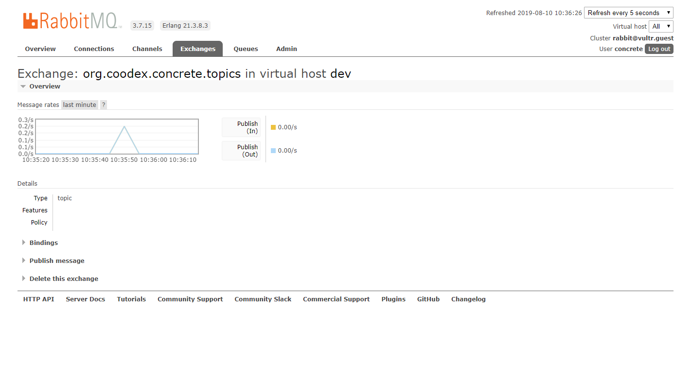

# Topic

Topic是对发布订阅模式的一种抽象。当我们的业务是消息驱动时，首选message broker来传递消息，开发者直接使用MQ或者JMS的开发接口来发布、订阅消息，使得系统的架构被限定在某种具体的技术环境下，`concrete`的目标就是为了通过对模式的抽象隔离系统架构、研发对具体技术的依赖。

传统模式下，如果设计、开发者有足够的经验，也会把技术依赖通过封装隔离出来，不过。。。emm, how interesting...

既然更多的团队无暇进行封装隔离，那就concrete来帮着做了吧。

## 示例

```java
package org.coodex.concrete.demo.api.excepted;

import org.coodex.concrete.api.ConcreteService;

@ConcreteService
public interface MessageTriggerService {

    // 触发一条消息
    void trigger(String x);
}

```

```java
package org.coodex.concrete.demo.impl;

import org.coodex.concrete.demo.api.excepted.MessageTriggerService;
import org.coodex.concrete.message.Queue;
import org.coodex.concrete.message.Topic;

import javax.inject.Inject;
import javax.inject.Named;

@Named
public class MessageTriggerServiceImpl implements MessageTriggerService {

    // 定义一个主题，主题由主题类型，消息类型，队列三部分共同确定
    @Inject
    @Queue("demo")
    private Topic<String> topic;

    @Override
    public void trigger(String x) {
        topic.publish(x);// 使用这个主题发布一个消息
    }
}

```

定义一个消费者

```java
package org.coodex.concrete.demo.impl;

import org.coodex.concrete.message.MessageConsumer;
import org.coodex.concrete.message.Observer;
import org.slf4j.Logger;
import org.slf4j.LoggerFactory;

import javax.inject.Named;

@Named
@MessageConsumer(queue = "demo")
public class DemoMessageListener implements Observer<String> {
    private final static Logger log = LoggerFactory.getLogger(DemoMessageListener.class);

    @Override
    public void update(String message) throws Throwable {
        log.info("message received: {}", message);
    }
}
```

跑起来看看，swagger里点一下触发一个消息

```txt
2019-08-10 10:11:59.939  INFO 12484 --- [        topic-1] o.c.c.demo.impl.DemoMessageListener      : message received: KV2GRv
```

有什么用？这个案例实在太简单了，好像起不到任何作用。我们假设消息消费者和生产者在两个不同的虚拟机里，下面看看怎么做到

queue.demo.yml

```yml
destination: ${env:queue.destination} #与之前使用有所不同，需要在amqp之前增加rabbitmq:
username: ${env:amqp.username}
password: ${env:amqp.password}
```

注意一下，使用rabbitmq作为订阅发布的实现技术时，destination的格式为`rabbitmq:amqp(s)://usernmame:password@host:port/virtualHost`，username,password,host,port,virtualhost也可以通过Config指定，如上例中的username和password

我们这次使用rabbitmq来发布订阅消息

```xml
        <!-- 使用 rabbitmq 的消息传递者插件 -->
        <dependency>
            <groupId>org.coodex</groupId>
            <artifactId>concrete-courier-rabbitmq</artifactId>
        </dependency>
```

再来一下



我们看到，没有做任何代码的修改，我们很方便的把local方式切换到了rabbitmq。

除了rabbitmq以外，concrete还提供了activemq基于jms的插件。

特别的，concrete还提供的发布者的聚合能力，同一个消息可以发布到多个队列上，`destination=aggregated::queue1, queue2`即可。

> #### Note::
>
> concrete面向系统架构方面考虑比较多，截止到目前为止，我们还没有体验到太多。023开始，concrete注重系统的模块化，通过紧耦合(java client)、松耦合(发布订阅)的方式来让系统的架构可以更加灵活，配套一个基于配置中心的Configuration实现，统一维护模块的destination，可以灵活的设计、调整整个系统的架构，这样也能有效地降低系统架构设计的成本和经验门槛

## 扩展

- Couries: 我们看到amqp的Courier和activemq的Courier都是通过扩展达到的，开发者也可以开发自己的Couries
- TopicPrototype，开发者可以自行扩展自己的主题原型，在后面我们将看到一个TokenBasedTopic，它就是使用原型扩展出来的
