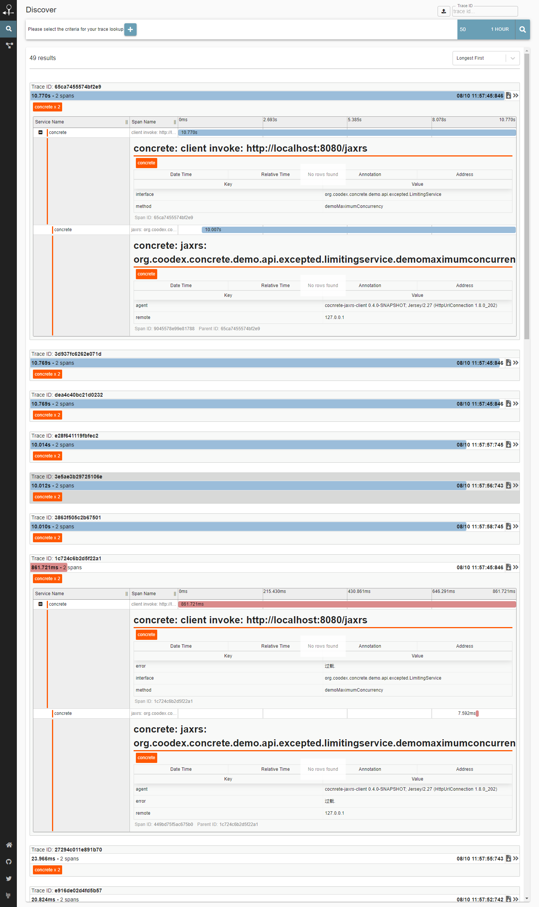

# APM 应用性能管理

在开发或者试运行环境中，我们需要一些数据来找到整个系统中的性能瓶颈，有针对性的分析优化，concrete的实践中，提供了一种无需埋点且支持扩展的APM方案。

concrete 默认的方案是基于[zipkin](https://github.com/openzipkin/zipkin)的，[点我查看](https://github.com/openzipkin/zipkin#quick-start)最简单的使用方式

我们按照quick-start先把zipkin跑起来

在`demo-boot`中引入zipkin的支持

```xml
        <!-- zipkin 的 concrete apm 插件 -->
        <dependency>
            <groupId>org.coodex</groupId>
            <artifactId>concrete-apm-zipkin</artifactId>
        </dependency>
```

我们用之前的案例跑跑，然后 http://localhost:9411/zipkin 



我们看到，包括java client, concrete 服务，所有调用链的性能情况都会在zipkin中反映出来。

concrete还基于mysql,mysql8两个版本的jdbc driver提供了zipkin的apm插件。
