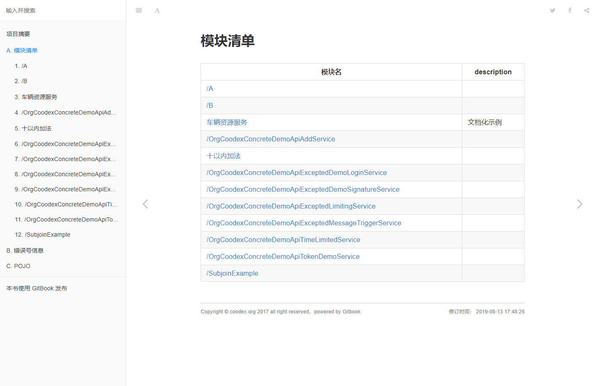
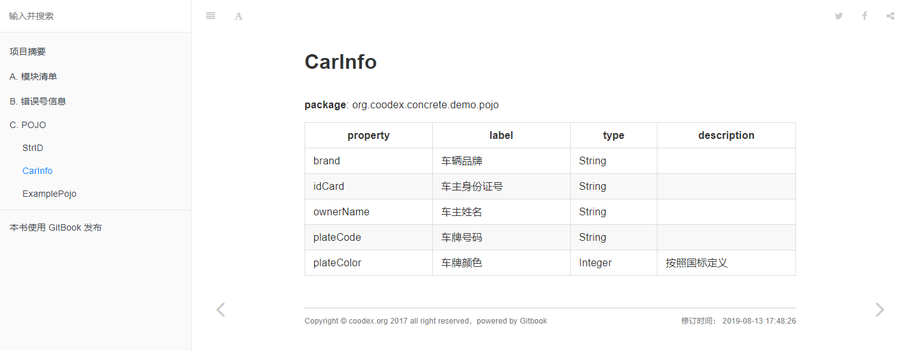

# 生成服务端文档

我们在前面的小节看到了使用swagger作为文档、调试一体化的工具，但是，swagger的阅读习惯可能不是那么符合一般人的阅读习惯，本节我们看看怎么使用`concrete`生成基于`gitbook`的文档。

增加依赖

```xml
<!-- 文档及脚本生成工具 -->
        <dependency>
            <groupId>org.coodex</groupId>
            <artifactId>concrete-api-tools</artifactId>
            <scope>test</scope>
        </dependency>
```

test作用域中增加代码

```java
package org.coodex.concrete.demo.boot;

import org.coodex.concrete.apitools.API;

import java.io.IOException;

public class DocGen {

    public static void main(String[] args) throws IOException {
        // 第一个参数说明使用哪个profile, api_gen.第一个参数
        API.generateFor("doc", "org.coodex.concrete.demo.**.api");
    }
}
```

`api_gen.doc.yml`

```yml
desc: JaxRS.doc.backend.gitbook.v1
path: ${env:doc.path}
```

上面的placeholder `${env:doc.path}`我们在之前已经说过了，我的配置是指定到了`工程目录/release/doc`

`nodejs` / `gitbook-cli`的安装就不多说了，进入到文档的目录，`gitbook install && gitbook serve`，http://localhost:4000




