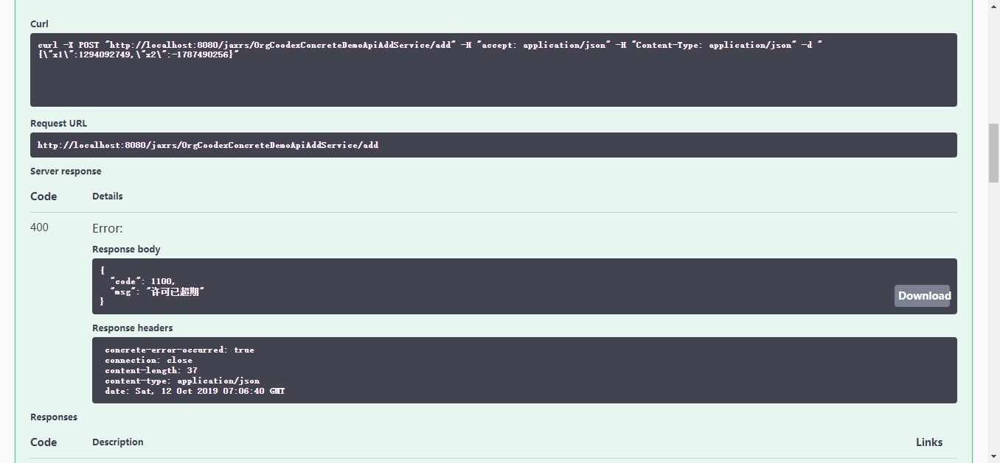
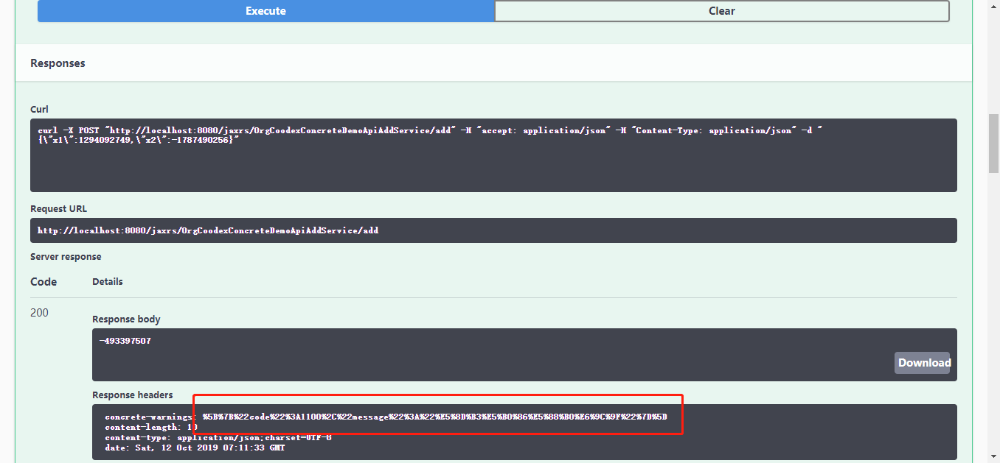

# License

concrete提供了一个License检测的拦截器，由开发者实现一个授权检测器放入SPI即可

授权检测器定义[参见]()

下面我们来做一个简单的授权检测器

```java
package org.coodex.concrete.demo.impl;

import org.coodex.concrete.core.License;
import org.coodex.util.Singleton;

import javax.inject.Named;
import java.util.Calendar;

@Named
public class DemoLicenseImpl implements License {

    // license到期日，通过改变到期日来演示效果
    private Singleton<Calendar> calendarSingleton = new Singleton<>(() -> {
        Calendar calendar = Calendar.getInstance();
        calendar.add(Calendar.DATE, -1);
        return calendar;
    });

    @Override
    public String check() throws OverdueException {
        Calendar now = Calendar.getInstance();
        Calendar deathLine = calendarSingleton.get();
        if (now.after(deathLine)) {
            throw new OverdueException("许可已超期");
        }
        // 如果3天以后到期，发警告
        now.add(Calendar.DATE, 3);
        if (now.after(deathLine)) {
            return "即将到期";
        }
        // 正常
        return null;
    }
}

```

DemoBootStarter里启用License检查拦截器

```java
    @Bean
    public LicenseCheckInterceptor licenseCheckInterceptor(){
        return new LicenseCheckInterceptor();
    }
```

跑起来，随便跑个客户端实例

第一次是超时的效果：



我们改一下过期时间为明天

```java
        calendar.add(Calendar.DATE, 1);
```

按照逻辑，到期3天内提示警告



上图中，我们看到，结果正常返回，红框中就是警告信息。

改到10天后到期再跑

```java
        calendar.add(Calendar.DATE, 10);
```

不贴图了，就是正常也没警告，预期达成。

如果开发者有现有的license库，只需要实现一个License接口进行桥接即可
