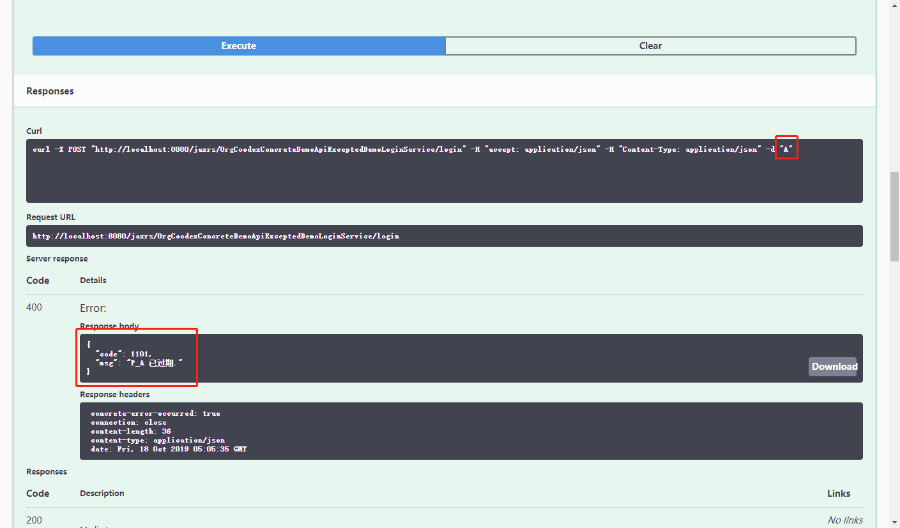
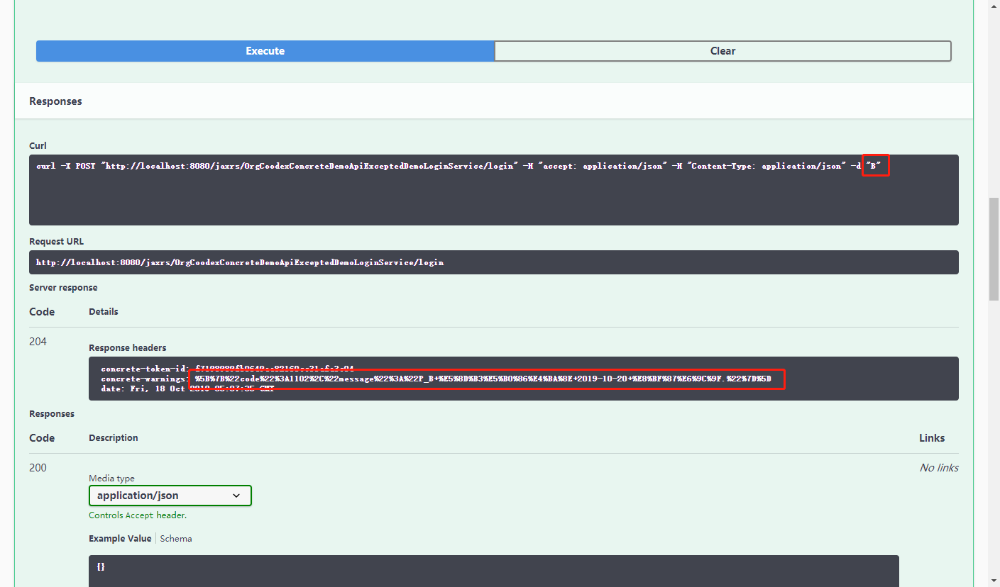
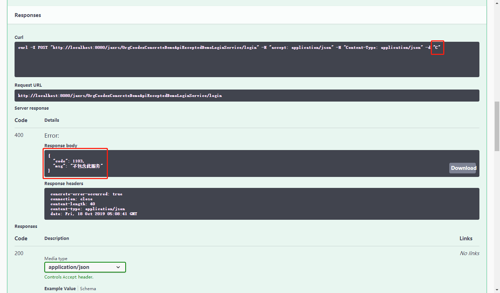

# SaaS模式授权

软件平台在SaaS模式下，我们经常提供一套完整的功能服务，差异化组合成不同的产品，由租户选择购买自己所需的产品进行购买，平台可以根据不同的用户、不同的产品进行服务许可控制。

## 示例

我们在已有的代码基础上设计一个场景来体验一下。

我们假设[前面](09.rbac.md)的A,B,C分别属于一个租户，A购买了产品P_A（M1），B购买了产品P_B(M1,M2), C购买了产品P_C(M3)

先对相关服务进行标记：

DemoLoginService.java

```java
    @Modules(values = {"M1", "M2"})
    void login(String id);
```

使用properties文件来管理产品授权信息

`P_A.properties`

```properties
modules=M1
validate=2019-10-10
```

`P_B.properties`

```properties
modules=M1, M2
validate=2019-10-20
```

`P_C.properties`

```properties
modules=M3
validate=2019-12-31
```

演示的ProductionRepository

```java
package org.coodex.concrete.demo.impl;

import org.coodex.concrete.common.Account;
import org.coodex.concrete.common.Production;
import org.coodex.concrete.common.ProductionRepository;
import org.coodex.concrete.demo.impl.account.DemoAccountFactory;
import org.coodex.util.Common;
import org.coodex.util.Profile;

import javax.inject.Named;
import java.text.ParseException;
import java.util.*;

@Named
public class DemoProductionRepository implements ProductionRepository {
    @Override
    public List<Production> getProductionsBy(Account account, String[] modules) {
        final DemoAccountFactory.DemoAccount demoAccount = (DemoAccountFactory.DemoAccount) account;
        return Collections.singletonList(new Production() {
            private String name = "P_" + demoAccount.getId();
            private Profile profile = Profile.get(name);
            private Set<String> modules = new HashSet<>(Arrays.asList(profile.getStrList("modules")));

            @Override
            public Calendar getCalendar() {
                try {
                    return Common.strToCalendar(profile.getString("validate"), Common.DEFAULT_DATE_FORMAT);
                } catch (ParseException e) {
                    throw new RuntimeException(e);
                }
            }

            @Override
            public Integer getRemindDays() {
                return 7;
            }

            @Override
            public String getProductionName() {
                return name;
            }

            @Override
            public Set<String> getModules() {
                return modules;
            }
        });
    }

    @Override
    public boolean accept(Account param) {
        return param instanceof DemoAccountFactory.DemoAccount;
    }
}
```

开启拦截器

`DemoBooStarter.java`

```java
    @Bean
    public ProductionValidationInterceptor productionValidationInterceptor() {
        return new ProductionValidationInterceptor();
    }
```

跑起来

- 使用A登录



- 使用B登录



- 使用C登录



## 与类似能力的区别

- 与应用License的区别：应用License的颗粒度是应用实例，产品授权颗粒度是功能性服务
- 与RBAC的区别：RBAC基于用户角色，属于业务属性，且与时间无关

## 扩展

[`ProductionRepository `](https://github.com/coodex2016/concrete.coodex.org/blob/0.4.x/01.spec/concrete-api/src/main/java/org/coodex/concrete/common/ProductionRepository.java)，根据需要自行实现并放入SPI环境即可。

