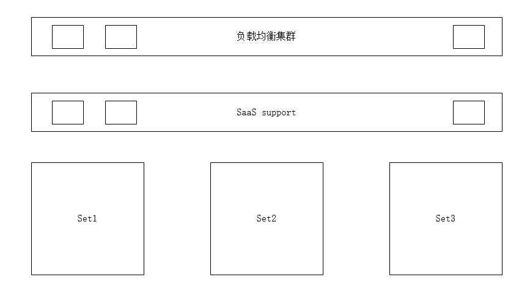

# SaaS支持
> since 0.2.1

提供一种支持Set化的SaaS服务的思路，架构示意如下：



上图中，负责均衡把所有的请求分发给Saas support层的节点，此层节点再根据租户参数或者与租户有关的参数进行分发，转发到租户所在的set集群执行业务

## 使用

引入artifact

```xml
        <dependency>
            <groupId>org.coodex</groupId>
            <artifactId>concrete-support-jaxrs-saas-reverse-proxy</artifactId>
        </dependency>
```

示例接口

```java
@MicroService("SaaS/{tenantId}/test")
@RouteBy("tenantId") // 根据哪个参数进行路由反查
public interface SaaSExample extends ConcreteService {

    // 注意：此模块下所有服务原子必须包含可反查的参数
    String exampleForSaaS(String tenantId, String ok);
}
```

实现Reverser服务接口(META-INF/services)

```java
public class ExampleReverser implements Reverser {
    private final static Logger log = LoggerFactory.getLogger(ExampleReverser.class);

    @Override
    public boolean accept(String param) {
        log.debug("accept: {}", param); 
        //根据反查参数名进行适配，当同一个系统有多种反查方式时，由此确定该Reverser是否支持
        return true;
    }

    @Override
    public String resolve(String routeBy) {
        log.debug("resolve by: {}", routeBy);
        // 本规则下根据具体参数值反查，根据各系统的set化策略设计
        return "http://localhost:8080/test/s";
    }
}
```

然后就ok啦